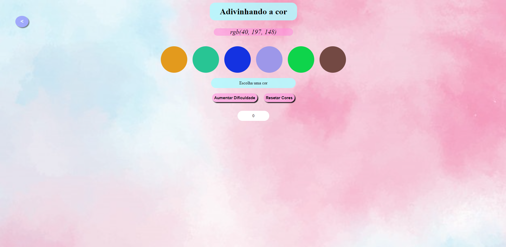

# Color Guess

Jogo de seleção de cores, onde é informado um código em RGB, e cores para selecionar a correta, adicionando pontos ao selecionar a cor certa.
## Demonstração

## Stack utilizada

**Front-end:** Html, Css, Javascript

## Aprendizados

Aprendi a interagir melhor com o javascript utilizando o DOM com funções de resultados aleatórios para geração de cores e resultados.
## Instalação

Coloque a pasta color-guess no local desejado.

## Rodando localmente

Para iniciar a aplicação, é preciso abrir o arquivo `index.html` no seu navegador e pronto!

## Autores
### Gabriel

|  |  |  |
| ------|-------|-----|